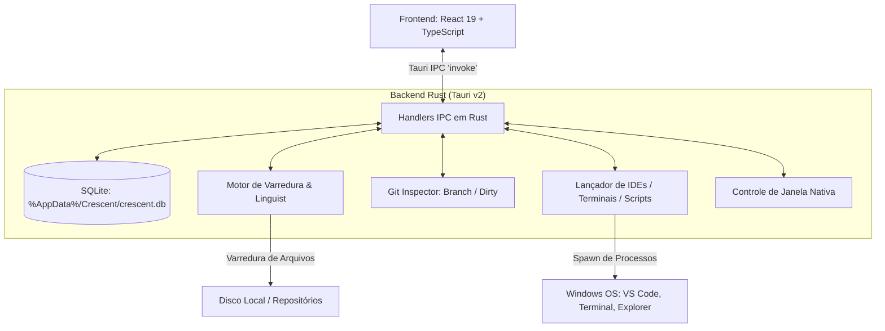

# Arquitetura do Crescent

Neste documento, eu descrevo em detalhes como estruturei a arquitetura interna do **Crescent**, tanto no backend em Rust quanto no frontend em React/TypeScript.

---

## 1. Visão Geral da Arquitetura

O Crescent opera como uma aplicação desktop híbrida utilizando o **Tauri v2**:
- **Backend (Rust):** Responsável pelo acesso ao sistema de arquivos local, execução de processos externos (IDEs, terminais, scripts), controle de janelas nativas, monitoramento do Git e gerenciamento do banco de dados SQLite local.
- **Frontend (React 19 + TypeScript):** Responsável por toda a renderização da interface, gerenciamento de estado reativo, atalhos de teclado e apresentação dos dados.
- **Camada de Comunicação (IPC Tauri):** Todas as chamadas entre React e Rust acontecem através de comandos assíncronos registrados com a macro `#[tauri::command]`.



---

## 2. Banco de Dados SQLite Local (`src-tauri/src/db.rs`)

Para garantir persistência segura e offline, eu utilizei a crate `rusqlite` com as seguintes definições:
- **Localização padrão no Windows:** `%AppData%/Crescent/crescent.db`.
- **Modo WAL (Write-Ahead Logging):** Ativado para permitir leituras simultâneas ultra rápidas sem travar transações de escrita.
- **Chaves Estrangeiras (`PRAGMA foreign_keys = ON;`):** Exclusões em cascata automáticas para tags, scripts e portas ao remover um projeto.

### Esquema das Tabelas:
```sql
-- Tabela principal de projetos
CREATE TABLE IF NOT EXISTS projects (
    id TEXT PRIMARY KEY,
    name TEXT NOT NULL,
    path TEXT NOT NULL UNIQUE,
    description TEXT DEFAULT '',
    tech_stack TEXT NOT NULL,       -- JSON Array: ["Rust", "Tauri", "React"]
    primary_tech TEXT NOT NULL,
    status TEXT NOT NULL DEFAULT 'active', -- 'active', 'on_hold', 'completed', 'archived'
    is_favorite INTEGER NOT NULL DEFAULT 0,
    is_pinned INTEGER NOT NULL DEFAULT 0,
    notes TEXT DEFAULT '',          -- Anotações em Markdown
    readme_cache TEXT,
    last_modified INTEGER NOT NULL,
    size_bytes INTEGER NOT NULL DEFAULT 0,
    git_branch TEXT,
    git_dirty INTEGER NOT NULL DEFAULT 0,
    created_at INTEGER NOT NULL,
    updated_at INTEGER NOT NULL
);

-- Tabela de tags
CREATE TABLE IF NOT EXISTS tags (
    id TEXT PRIMARY KEY,
    name TEXT NOT NULL UNIQUE,
    color TEXT NOT NULL DEFAULT '#a1a1aa'
);

-- Relacionamento N:N entre projetos e tags
CREATE TABLE IF NOT EXISTS project_tags (
    project_id TEXT NOT NULL,
    tag_id TEXT NOT NULL,
    PRIMARY KEY (project_id, tag_id),
    FOREIGN KEY (project_id) REFERENCES projects(id) ON DELETE CASCADE,
    FOREIGN KEY (tag_id) REFERENCES tags(id) ON DELETE CASCADE
);

-- Scripts rápidos associados a cada projeto
CREATE TABLE IF NOT EXISTS project_scripts (
    id TEXT PRIMARY KEY,
    project_id TEXT NOT NULL,
    name TEXT NOT NULL,
    command TEXT NOT NULL,
    FOREIGN KEY (project_id) REFERENCES projects(id) ON DELETE CASCADE
);

-- Portas locais associadas a cada projeto
CREATE TABLE IF NOT EXISTS project_ports (
    id TEXT PRIMARY KEY,
    project_id TEXT NOT NULL,
    port INTEGER NOT NULL,
    description TEXT DEFAULT '',
    FOREIGN KEY (project_id) REFERENCES projects(id) ON DELETE CASCADE
);

-- Configurações globais do usuário
CREATE TABLE IF NOT EXISTS settings (
    key TEXT PRIMARY KEY,
    value TEXT NOT NULL
);
```

---

## 3. Motor de Varredura e Detecção Linguística (`src-tauri/src/scanner.rs`)

Eu construí o motor de varredura recursiva baseado em duas etapas complementares:

### Etapa 1: Inspeção de Manifestos e Configurações
- **Rust:** `Cargo.toml` -> Extrai o nome do pacote e dependências principais (`tauri`, `tokio`, `axum`, `actix-web`, `bevy`, `leptos`, `yew`, etc.).
- **Node / JS / TS:** `package.json`, `bun.lockb`, `deno.json` -> Detecta frameworks como Next.js, Nuxt, SvelteKit, Astro, Remix, SolidJS, Angular, NestJS, Express, Fastify, Hono, React Native, Electron, etc.
- **Python:** `pyproject.toml`, `requirements.txt`, `Pipfile`, `manage.py` -> Detecta Django, FastAPI, Flask, Streamlit, PyTorch, TensorFlow, Hugging Face, LangChain, etc.
- **Go:** `go.mod` -> Extrai o nome do módulo e dependências (`gin`, `fiber`, `echo`, `gorm`, `cobra`, `wails`, `templ`).
- **C# / .NET:** `*.sln`, `*.csproj`, `*.fsproj` -> Detecta ASP.NET Core, Blazor, .NET MAUI, Unity, WPF.
- **C / C++:** `CMakeLists.txt`, `Makefile`, `meson.build` -> Detecta Qt, OpenCV, Unreal Engine.
- **Java / Kotlin / JVM:** `pom.xml`, `build.gradle`, `build.gradle.kts`, `build.sbt` -> Detecta Spring Boot, Quarkus, Android, Ktor, Scala.
- **PHP:** `composer.json`, `wp-config.php`, `artisan` -> Detecta Laravel, Symfony, WordPress.
- **Ruby:** `Gemfile` -> Detecta Ruby on Rails, Sinatra, Jekyll.
- **Elixir / Dart / Swift / Zig / Lua / Solidity / Cloud:** `mix.exs`, `pubspec.yaml`, `Package.swift`, `build.zig`, `init.lua`, `hardhat.config.js`, `Dockerfile`, `k8s/`, `terraform/`.

### Etapa 2: Perfilamento por Extensão de Arquivos (Estilo GitHub Linguist)
Quando um projeto contém múltiplos arquivos de código, o Crescent faz uma contagem das extensões (`.rs`, `.ts`, `.py`, `.go`, `.cs`, `.cpp`, `.java`, etc.) para identificar a linguagem predominante e calcular com precisão as linguagens secundárias utilizadas.

---

## 4. Integração Git & Sistema de Ações (`src-tauri/src/git.rs` & `actions.rs`)

### Git Inspector:
- Executa comandos `git status` e `git rev-parse` com a flag `CREATE_NO_WINDOW` no Windows para inspecionar a branch atual e se há arquivos modificados ou uncommitted, sem abrir janelas pretas de terminal na tela.

### Lançador de IDEs e Terminais:
- **Editores Suportados:** VS Code (`code`), Cursor (`cursor`), Zed (`zed`), IntelliJ IDEA (`idea`), WebStorm (`webstorm`), PyCharm (`pycharm`) e executáveis customizados.
- **Terminais Suportados:** Windows Terminal (`wt.exe -d <path>`), PowerShell (`powershell.exe -NoExit -Command Set-Location -LiteralPath '<path>'`), Git Bash (`git-bash.exe --cd=<path>`), Prompt de Comando (`cmd.exe /k cd /d "<path>"`) e terminais customizados.
- **Explorador de Arquivos:** `explorer.exe <path>`.
- **Scripts de Projeto:** `cmd /c <comando>` com captura assíncrona de `stdout` e `stderr` em tempo real para exibir o log de execução diretamente no modal do projeto.
