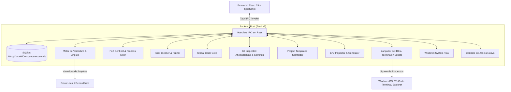

# Arquitetura do Crescent

Neste documento, eu descrevo em detalhes como estruturei a arquitetura interna do **Crescent**, tanto no backend em Rust quanto no frontend em React/TypeScript.

---

## 1. Visão Geral da Arquitetura

O Crescent opera como uma aplicação desktop híbrida utilizando o **Tauri v2**:
- **Backend (Rust):** Responsável pelo acesso ao sistema de arquivos local, execução de processos externos (IDEs, terminais, scripts), controle de janelas nativas, monitoramento do Git, gerenciamento de portas TCP, limpeza de disco, busca global de código, gerador de projetos, inspetor de `.env` e banco de dados SQLite local.
- **Frontend (React 19 + TypeScript):** Responsável por toda a renderização da interface, gerenciamento de estado reativo, atalhos de teclado e apresentação dos dados.
- **Camada de Comunicação (IPC Tauri):** Todas as chamadas entre React e Rust acontecem através de comandos assíncronos registrados com a macro `#[tauri::command]`.



---

## 2. Banco de Dados SQLite Local (`src-tauri/src/db.rs`)

Para garantir persistência segura e offline, eu utilizei a crate `rusqlite` com as seguintes definições:
- **Localização padrão no Windows:** `%AppData%/Crescent/crescent.db`.
- **Modo WAL (Write-Ahead Logging):** Ativado para permitir leituras simultâneas ultra rápidas sem travar transações de escrita.
- **Chaves Estrangeiras (`PRAGMA foreign_keys = ON;`):** Exclusões em cascata automáticas para tags, scripts e portas ao remover um projeto.

### Esquema das Tabelas:
```sql
-- Tabela principal de projetos
CREATE TABLE IF NOT EXISTS projects (
    id TEXT PRIMARY KEY,
    name TEXT NOT NULL,
    path TEXT NOT NULL UNIQUE,
    description TEXT DEFAULT '',
    tech_stack TEXT NOT NULL,       -- JSON Array: ["Rust", "Tauri", "React"]
    primary_tech TEXT NOT NULL,
    status TEXT NOT NULL DEFAULT 'active', -- 'active', 'on_hold', 'completed', 'archived'
    is_favorite INTEGER NOT NULL DEFAULT 0,
    is_pinned INTEGER NOT NULL DEFAULT 0,
    notes TEXT DEFAULT '',          -- Anotações em Markdown
    readme_cache TEXT,
    last_modified INTEGER NOT NULL,
    size_bytes INTEGER NOT NULL DEFAULT 0,
    git_branch TEXT,
    git_dirty INTEGER NOT NULL DEFAULT 0,
    created_at INTEGER NOT NULL,
    updated_at INTEGER NOT NULL
);

-- Tabela de tags
CREATE TABLE IF NOT EXISTS tags (
    id TEXT PRIMARY KEY,
    name TEXT NOT NULL UNIQUE,
    color TEXT NOT NULL DEFAULT '#a1a1aa'
);

-- Relacionamento N:N entre projetos e tags
CREATE TABLE IF NOT EXISTS project_tags (
    project_id TEXT NOT NULL,
    tag_id TEXT NOT NULL,
    PRIMARY KEY (project_id, tag_id),
    FOREIGN KEY (project_id) REFERENCES projects(id) ON DELETE CASCADE,
    FOREIGN KEY (tag_id) REFERENCES tags(id) ON DELETE CASCADE
);

-- Tabela de Workspaces / Grupos de Projetos
CREATE TABLE IF NOT EXISTS workspaces (
    id TEXT PRIMARY KEY,
    name TEXT NOT NULL UNIQUE,
    description TEXT DEFAULT '',
    created_at INTEGER NOT NULL
);

-- Relacionamento N:N entre workspaces e projetos
CREATE TABLE IF NOT EXISTS workspace_projects (
    workspace_id TEXT NOT NULL,
    project_id TEXT NOT NULL,
    PRIMARY KEY (workspace_id, project_id),
    FOREIGN KEY (workspace_id) REFERENCES workspaces(id) ON DELETE CASCADE,
    FOREIGN KEY (project_id) REFERENCES projects(id) ON DELETE CASCADE
);

-- Scripts rápidos associados a cada projeto
CREATE TABLE IF NOT EXISTS project_scripts (
    id TEXT PRIMARY KEY,
    project_id TEXT NOT NULL,
    name TEXT NOT NULL,
    command TEXT NOT NULL,
    FOREIGN KEY (project_id) REFERENCES projects(id) ON DELETE CASCADE
);

-- Portas locais associadas a cada projeto
CREATE TABLE IF NOT EXISTS project_ports (
    id TEXT PRIMARY KEY,
    project_id TEXT NOT NULL,
    port INTEGER NOT NULL,
    description TEXT DEFAULT '',
    FOREIGN KEY (project_id) REFERENCES projects(id) ON DELETE CASCADE
);

-- Configurações globais do usuário
CREATE TABLE IF NOT EXISTS settings (
    key TEXT PRIMARY KEY,
    value TEXT NOT NULL
);
```

---

## 3. Módulos Especializados do Backend Rust

### 3.1. Port Sentinel (`src-tauri/src/port_sentinel.rs`)
- Inspeciona portas TCP ativas no Windows através de `netstat -ano -p tcp` sem criar janelas (`CREATE_NO_WINDOW`).
- Mapeia o PID e descobre o executável responsável (`node.exe`, `python.exe`, `cargo.exe`, etc.) via `tasklist`.
- Fornece o comando `kill_process_on_port` para encerrar o processo travando a porta via `taskkill /PID <pid> /F`.

### 3.2. Disk Cleaner & Pruner (`src-tauri/src/cleaner.rs`)
- Analisa os tamanhos exatos das pastas de build e dependências (`node_modules`, `target`, `.venv`, `dist`, `build`, `.next`, `.nuxt`, `.turbo`).
- Executa a remoção segura em lote para liberar dezenas de gigabytes de espaço em disco com 1 clique.

### 3.3. Busca Global de Código / Grep (`src-tauri/src/code_search.rs`)
- Percorre todos os repositórios cadastrados usando `WalkDir` e buffers de leitura rápida em Rust.
- Ignora pastas pesadas e arquivos binários (> 1MB ou extensões de imagem/executável).
- Retorna o número da linha, caminho relativo e snippet de código para navegação direta.

### 3.4. Gerador de Projetos por Templates (`src-tauri/src/scaffolder.rs`)
- Cria projetos estruturados com Vite React/TS, Next.js, Tauri v2, FastAPI, Go Gin e Rust CLI.
- Registra automaticamente o novo projeto no banco de dados local do Crescent.

### 3.5. Gerenciador de Variáveis `.env` (`src-tauri/src/env_manager.rs`)
- Compara arquivos `.env` e `.env.example` para alertar o desenvolvedor sobre chaves de configuração faltantes.
- Permite gerar o `.env` inicial com 1 clique.

### 3.6. Git Insights & Heatmap (`src-tauri/src/git.rs`)
- Rastreia contagem de commits locais não enviados (*ahead/behind* com `git rev-list --count @{u}..HEAD`).
- Extrai histórico formatado dos últimos commits do projeto (`hash`, `short_hash`, `mensagem`, `autor`, `tempo_relativo`).
- Agrega dados de commits dos últimos 90 dias de todos os repositórios para alimentar o Heatmap de Produtividade Local.

### 3.7. System Tray no Windows (`src-tauri/src/tray.rs`)
- Registra o ícone do Crescent na barra de tarefas do Windows.
- Permite abrir a janela principal, acessar a paleta de comandos ou sair do aplicativo com clique rápido.
